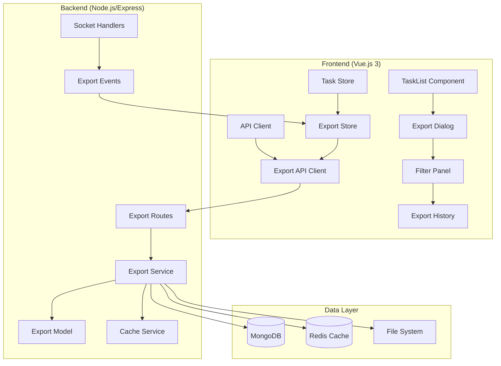

# Design Document

## Overview

The Task Export and Advanced Filtering System extends the existing task analytics dashboard with comprehensive data export capabilities and enhanced filtering options. The system maintains the established architecture patterns using Node.js/Express backend with MongoDB and Redis, Vue.js 3 frontend with Pinia state management, and Socket.IO for real-time communication.

The design follows the existing codebase patterns for API design, error handling, caching strategies, and component architecture while introducing new models and services for export functionality.

## Architecture

### High-Level Architecture



### Component Integration

The export system integrates with existing components:
- **TaskList.vue**: Enhanced with export button and advanced filters
- **taskStore.js**: Extended with export-related state management
- **api/client.js**: New export API methods
- **analyticsService.js**: Export metrics integration
- **socketHandlers.js**: Real-time export progress events

## Components and Interfaces

### Backend Components

#### 1. Export Model (`models/Export.js`)

```javascript
const exportSchema = new mongoose.Schema({
  userId: String,           // Future user identification
  format: {
    type: String,
    enum: ['csv', 'json'],
    required: true
  },
  filters: {
    status: String,
    priority: String,
    dateFrom: Date,
    dateTo: Date,
    search: String,
    sortBy: String,
    sortOrder: String
  },
  totalRecords: Number,
  fileSize: Number,
  filePath: String,
  downloadUrl: String,
  status: {
    type: String,
    enum: ['processing', 'completed', 'failed'],
    default: 'processing'
  },
  progress: {
    type: Number,
    default: 0,
    min: 0,
    max: 100
  },
  error: String,
  expiresAt: {
    type: Date,
    default: () => new Date(Date.now() + 24 * 60 * 60 * 1000) // 24 hours
  }
}, { timestamps: true });
```

#### 2. Export Service (`services/exportService.js`)

```javascript
class ExportService {
  // Core export functionality
  static async createExport(filters, format)
  static async processExport(exportId)
  static async generateCSV(tasks)
  static async generateJSON(tasks)
  
  // Cache management
  static async getCachedExport(cacheKey)
  static async setCachedExport(cacheKey, exportData)
  static async invalidateExportCache(filters)
  
  // File management
  static async saveExportFile(data, format, exportId)
  static async cleanupExpiredFiles()
  
  // Progress tracking
  static async updateProgress(exportId, progress)
  static async markCompleted(exportId, fileInfo)
  static async markFailed(exportId, error)
}
```

#### 3. Enhanced Task Filtering (`services/taskFilterService.js`)

```javascript
class TaskFilterService {
  static buildFilterQuery(filters) {
    const query = {};
    
    // Status filtering
    if (filters.status) query.status = filters.status;
    
    // Priority filtering  
    if (filters.priority) query.priority = filters.priority;
    
    // Date range filtering
    if (filters.dateFrom || filters.dateTo) {
      query.createdAt = {};
      if (filters.dateFrom) query.createdAt.$gte = new Date(filters.dateFrom);
      if (filters.dateTo) query.createdAt.$lte = new Date(filters.dateTo);
    }
    
    // Text search across title, description
    if (filters.search) {
      query.$or = [
        { title: { $regex: filters.search, $options: 'i' } },
        { description: { $regex: filters.search, $options: 'i' } }
      ];
    }
    
    return query;
  }
  
  static buildSortOptions(sortBy, sortOrder) {
    const sort = {};
    sort[sortBy || 'createdAt'] = sortOrder === 'asc' ? 1 : -1;
    return sort;
  }
}
```

#### 4. Export API Routes (`routes/exportRoutes.js`)

```javascript
// POST /api/exports - Create new export
router.post('/exports', async (req, res, next) => {
  // Validate filters and format
  // Check cache for existing export
  // Create export record
  // Queue processing job
  // Return export ID and status
});

// GET /api/exports/:id - Get export status
router.get('/exports/:id', async (req, res, next) => {
  // Return export status and progress
  // Include download URL if completed
});

// GET /api/exports/:id/download - Download export file
router.get('/exports/:id/download', async (req, res, next) => {
  // Validate export exists and is completed
  // Stream file to client
  // Track download metrics
});

// GET /api/exports - Get export history
router.get('/exports', async (req, res, next) => {
  // Return paginated export history
  // Include status and metadata
});

// DELETE /api/exports/:id - Cancel/delete export
router.delete('/exports/:id', async (req, res, next) => {
  // Cancel processing if in progress
  // Delete export record and file
});
```

### Frontend Components

#### 1. Enhanced TaskList Component

```vue
<template>
  <div>
    <!-- Existing task list content -->
    
    <!-- Enhanced Filter Panel -->
    <v-expansion-panels class="mb-4">
      <v-expansion-panel>
        <v-expansion-panel-title>
          <v-icon left>mdi-filter</v-icon>
          Advanced Filters
          <v-chip v-if="activeFiltersCount" size="small" class="ml-2">
            {{ activeFiltersCount }}
          </v-chip>
        </v-expansion-panel-title>
        <v-expansion-panel-text>
          <advanced-filter-panel 
            v-model="filters" 
            @update="updateFilters"
            @export="showExportDialog = true"
          />
        </v-expansion-panel-text>
      </v-expansion-panel>
    </v-expansion-panels>
    
    <!-- Export Dialog -->
    <export-dialog 
      v-model="showExportDialog"
      :filters="filters"
      @export-created="handleExportCreated"
    />
  </div>
</template>
```

#### 2. Advanced Filter Panel Component

```vue
<template>
  <v-card flat>
    <v-card-text>
      <v-row>
        <!-- Text Search -->
        <v-col cols="12" md="6">
          <v-text-field
            v-model="localFilters.search"
            label="Search tasks..."
            prepend-inner-icon="mdi-magnify"
            clearable
            @update:model-value="debouncedUpdate"
          />
        </v-col>
        
        <!-- Date Range -->
        <v-col cols="12" md="3">
          <v-text-field
            v-model="localFilters.dateFrom"
            label="From Date"
            type="date"
            @update:model-value="updateFilters"
          />
        </v-col>
        <v-col cols="12" md="3">
          <v-text-field
            v-model="localFilters.dateTo"
            label="To Date"
            type="date"
            @update:model-value="updateFilters"
          />
        </v-col>
        
        <!-- Existing status/priority filters -->
        <!-- ... -->
      </v-row>
      
      <v-row class="mt-2">
        <v-col>
          <v-btn @click="clearFilters" variant="outlined">
            Clear Filters
          </v-btn>
          <v-btn 
            @click="$emit('export')" 
            color="primary" 
            variant="outlined"
            class="ml-2"
          >
            <v-icon left>mdi-download</v-icon>
            Export Filtered Data
          </v-btn>
        </v-col>
      </v-row>
    </v-card-text>
  </v-card>
</template>
```

#### 3. Export Dialog Component

```vue
<template>
  <v-dialog v-model="dialog" max-width="600">
    <v-card>
      <v-card-title>Export Tasks</v-card-title>
      <v-card-text>
        <!-- Export Format Selection -->
        <v-radio-group v-model="exportFormat" label="Export Format">
          <v-radio label="CSV (Comma Separated Values)" value="csv" />
          <v-radio label="JSON (JavaScript Object Notation)" value="json" />
        </v-radio-group>
        
        <!-- Filter Summary -->
        <v-card variant="outlined" class="mt-4">
          <v-card-title class="text-subtitle-1">
            Export Preview
          </v-card-title>
          <v-card-text>
            <p><strong>Estimated Records:</strong> {{ estimatedCount }}</p>
            <p><strong>Applied Filters:</strong></p>
            <v-chip-group>
              <v-chip v-for="filter in activeFilters" :key="filter.key">
                {{ filter.label }}: {{ filter.value }}
              </v-chip>
            </v-chip-group>
          </v-card-text>
        </v-card>
      </v-card-text>
      
      <v-card-actions>
        <v-spacer />
        <v-btn @click="dialog = false">Cancel</v-btn>
        <v-btn 
          @click="startExport" 
          color="primary"
          :loading="creating"
        >
          Start Export
        </v-btn>
      </v-card-actions>
    </v-card>
  </v-dialog>
</template>
```

#### 4. Export Progress Component

```vue
<template>
  <v-card class="export-progress">
    <v-card-text>
      <div class="d-flex align-center">
        <v-icon class="mr-2">mdi-download</v-icon>
        <div class="flex-grow-1">
          <div class="d-flex justify-space-between">
            <span>{{ export.format.toUpperCase() }} Export</span>
            <span>{{ export.progress }}%</span>
          </div>
          <v-progress-linear 
            :model-value="export.progress"
            :color="getProgressColor(export.status)"
            class="mt-1"
          />
          <div class="text-caption mt-1">
            {{ getStatusText(export.status) }}
          </div>
        </div>
        <v-btn 
          v-if="export.status === 'completed'"
          @click="downloadExport"
          icon
          size="small"
        >
          <v-icon>mdi-download</v-icon>
        </v-btn>
      </div>
    </v-card-text>
  </v-card>
</template>
```

#### 5. Export Store (`stores/exportStore.js`)

```javascript
export const useExportStore = defineStore('exports', () => {
  const exports = ref([]);
  const activeExports = ref([]);
  const exportHistory = ref([]);
  
  // Actions
  async function createExport(filters, format) {
    // Call API to create export
    // Add to active exports
    // Set up progress tracking
  }
  
  async function getExportStatus(exportId) {
    // Poll export status
    // Update progress
  }
  
  async function downloadExport(exportId) {
    // Trigger download
    // Track download metrics
  }
  
  function handleExportProgress(data) {
    // Update export progress from socket
  }
  
  function handleExportComplete(data) {
    // Move from active to history
    // Show completion notification
  }
  
  return {
    exports,
    activeExports,
    exportHistory,
    createExport,
    getExportStatus,
    downloadExport,
    handleExportProgress,
    handleExportComplete
  };
});
```

## Data Models

### Export Document Schema

```javascript
{
  _id: ObjectId,
  userId: String,              // Future user identification
  format: String,              // 'csv' | 'json'
  filters: {
    status: String,            // Task status filter
    priority: String,          // Task priority filter
    dateFrom: Date,            // Start date filter
    dateTo: Date,              // End date filter
    search: String,            // Text search query
    sortBy: String,            // Sort field
    sortOrder: String          // 'asc' | 'desc'
  },
  totalRecords: Number,        // Number of exported records
  fileSize: Number,            // File size in bytes
  filePath: String,            // Server file path
  downloadUrl: String,         // Public download URL
  status: String,              // 'processing' | 'completed' | 'failed'
  progress: Number,            // 0-100 percentage
  error: String,               // Error message if failed
  downloadCount: Number,       // Track download frequency
  createdAt: Date,
  updatedAt: Date,
  expiresAt: Date             // Auto-cleanup timestamp
}
```

### Enhanced Task Query Interface

```javascript
{
  // Existing filters
  status: String,
  priority: String,
  sortBy: String,
  sortOrder: String,
  
  // New advanced filters
  search: String,              // Text search across title/description
  dateFrom: String,            // ISO date string
  dateTo: String,              // ISO date string
  createdBy: String,           // Future user filtering
  tags: Array<String>          // Future tag filtering
}
```

## Error Handling

### Backend Error Scenarios

1. **Invalid Filter Parameters**
   - Validation using Joi or similar
   - Return 400 with specific field errors
   - Log validation failures

2. **Export Processing Failures**
   - Database connection issues
   - File system write errors
   - Memory limitations for large datasets
   - Mark export as failed with error details

3. **File Access Errors**
   - Missing export files
   - Permission issues
   - Expired downloads
   - Return appropriate HTTP status codes

4. **Cache Failures**
   - Redis connection issues
   - Cache corruption
   - Fallback to direct processing

### Frontend Error Handling

1. **Network Errors**
   - API request failures
   - Socket connection issues
   - Retry mechanisms with exponential backoff

2. **User Input Validation**
   - Date range validation
   - Format selection validation
   - Filter combination validation

3. **Export Process Errors**
   - Progress tracking failures
   - Download initiation errors
   - File corruption notifications

## Testing Strategy

### Backend Testing

#### Unit Tests
- **Export Service Tests**
  - Filter query building
  - CSV/JSON generation
  - Cache key generation
  - File operations

- **Export Model Tests**
  - Schema validation
  - Middleware functions
  - Query methods

- **API Route Tests**
  - Request validation
  - Response formatting
  - Error handling
  - Authentication (future)

#### Integration Tests
- **Database Operations**
  - Export CRUD operations
  - Task filtering queries
  - Cache integration

- **File System Operations**
  - Export file generation
  - File cleanup processes
  - Download streaming

- **Socket Communication**
  - Progress broadcasting
  - Event handling
  - Connection management

### Frontend Testing

#### Component Tests
- **Export Dialog**
  - Format selection
  - Filter display
  - Export initiation

- **Filter Panel**
  - Filter application
  - Search functionality
  - Date range validation

- **Progress Components**
  - Progress display
  - Status updates
  - Download triggers

#### Store Tests
- **Export Store**
  - State management
  - API integration
  - Socket event handling

#### End-to-End Tests
- **Export Workflow**
  - Complete export process
  - Download functionality
  - Error scenarios

### Performance Testing

#### Load Testing
- **Concurrent Exports**
  - Multiple simultaneous exports
  - Resource utilization
  - Queue management

- **Large Dataset Exports**
  - Memory usage patterns
  - Processing time limits
  - File size limitations

#### Cache Performance
- **Cache Hit Rates**
  - Export cache effectiveness
  - Cache invalidation timing
  - Memory usage optimization

## Performance Considerations

### Backend Optimizations

1. **Database Query Optimization**
   - Proper indexing for filter fields
   - Aggregation pipeline optimization
   - Query result streaming for large datasets

2. **Caching Strategy**
   - Export result caching with TTL
   - Cache key generation based on filters
   - Intelligent cache invalidation

3. **File Processing**
   - Streaming file generation
   - Chunked processing for large datasets
   - Background job processing

4. **Memory Management**
   - Limit concurrent exports per user
   - Stream processing to avoid memory spikes
   - Garbage collection optimization

### Frontend Optimizations

1. **Component Performance**
   - Virtual scrolling for large filter lists
   - Debounced search input
   - Lazy loading of export history

2. **State Management**
   - Selective store updates
   - Computed property optimization
   - Memory leak prevention

3. **Network Optimization**
   - Request deduplication
   - Progressive loading
   - Efficient polling strategies

## Security Considerations

### Data Protection
- Input sanitization for all filter parameters
- SQL injection prevention in dynamic queries
- File path traversal protection
- Export file access control

### Rate Limiting
- Export creation rate limits per user/IP
- Download frequency limits
- Resource usage monitoring

### File Security
- Secure file storage location
- Temporary file cleanup
- Download URL expiration
- File access logging

## Deployment Considerations

### Environment Configuration
- Export file storage path configuration
- Cache TTL settings
- File cleanup schedules
- Resource limit configuration

### Monitoring
- Export success/failure rates
- Processing time metrics
- File storage usage
- Cache performance metrics

### Scalability
- Horizontal scaling considerations
- Load balancer configuration
- Database connection pooling
- Redis cluster setup